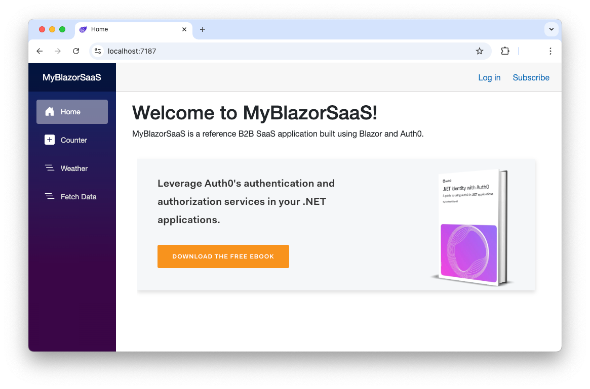

This repository contains a basic B2B Blazor Web application integrated with Auth0 Organizations.

Read the following articles to learn more about it:

- [Add Auth0 Organizations to Your B2B Blazor Web App](https://auth0.com/blog/auth0-organizations-for-b2b-saas-blazor-web-apps/)
- [Enable Self-Subscribing Model in Your Blazor B2B SaaS Application](https://auth0.com/blog/enable-self-subscription-in-blazor-b2b-saas-application)
- [Enforce Customer Email Verification in Your B2B Blazor Web App](https://auth0.com/blog/enforce-customer-email-verification-b2b-saas-blazor-app) 
- [Implementing Role-Based Access Control in Your Blazor B2B SaaS Application](https://auth0.com/blog/role-management-auth0-organizations-b2b-saas/)


# Requirements

- [.NET 9 SDK](https://dotnet.microsoft.com/download/dotnet/9.0) installed on your machine

# To run this application

1. Clone the repo with the following command:

   ```bash
   git clone https://github.com/andychiare/MyBlazorSaaS
   ```

2. Move to the `MyBlazorSaaS\MyBlazorSaaS` folder.

3. [Register the web app with Auth0](https://auth0.com/docs/get-started/auth0-overview/create-applications/regular-web-apps) and add your Auth0 domain and client ID to the `appsettings.json` configuration file.

4. Make sure you have [enabled Organization support for the application in your Auth0 tenant](https://auth0.com/docs/manage-users/organizations/login-flows-for-organizations#configure-your-application-to-use-organizations).

5. Create an [Auth0 Action](https://auth0.com/docs/customize/actions) that handles the [Post Login trigger](https://auth0.com/docs/customize/actions/explore-triggers/signup-and-login-triggers/login-trigger) with the following code:
   ```javascript
   exports.onExecutePostLogin = async (event, api) => { 
     const roleClaim = 'http://schemas.microsoft.com/ws/2008/06/identity/claims/role';
   
     if (event.authorization) { 
       api.idToken.setCustomClaim(roleClaim, event.authorization.roles);
     }
   }
   ```

6. Type `dotnet run` in a terminal window to launch the application.

7. Point your browser to the [https://localhost:7187](https://localhost:7187) address. You should see a web page like the following:

